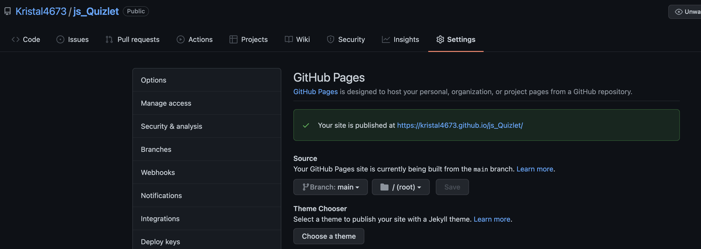

# 04 Web APIs: Code Quiz

## Your Task

This is a javascript based quizlet. Its only a four question quiz but all buttons function and I used all requirements. 

## User Story

```
AS A coding boot camp student
I WANT to take a timed quiz on JavaScript fundamentals that stores high scores
SO THAT I can gauge my progress compared to my peers
```

## Acceptance Criteria

```
GIVEN I am taking a code quiz
WHEN I click the start button
THEN a timer starts and I am presented with a question
WHEN I answer a question
THEN I am presented with another question
WHEN I answer a question incorrectly
THEN time is subtracted from the clock
WHEN all questions are answered or the timer reaches 0
THEN the game is over
WHEN the game is over
THEN I can save my initials and my score
```

## Link 
youtube: https://youtu.be/LnUzZteCPfs

github: https://github.com/Kristal4673/js_Quizlet.git

Deployed Link: https://kristal4673.github.io/js_Quizlet/

## Picture github Page 



